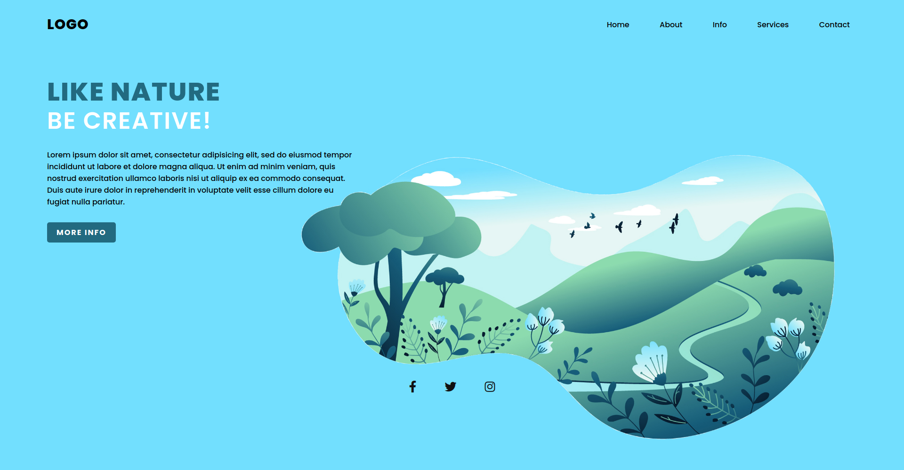

<h1 align="center">Creative Nature</h1>

## Table of Contents

- [Overview](#overview)

  - [Built With](#built-with)

- [How to use](#how-to-use)

- [Acknowledgements](#acknowledgements)

- [Credit](#credit)

- [Contact](#contact)

## Overview



## Built With

- [HTML](#built-with)
- [CSS](#built-with)

## How To Use

To clone and run this application, you'll need [Git](https://git-scm.com) installed on your computer. From your command line:
## Clone this repository
```bash
git clone https://github.com/saadman-galib/Creative-Nature.git
```
## Acknowledgements

- [Steps to replicate a hero section design with only HTML and CSS](#acknowledgements)

## Credit
- I have made this project by following the tutorial of Coding Show

## Contact

- GitHub [@saadman-galib](https://www.github.com/saadman-galib)
- Twitter [@GalibSaadman](https://www.twitter.com/GalibSaadman)
- Facebok Page [@Saadman Codes](https://www.facebook.com/saadman.codes/)